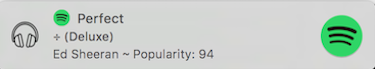
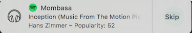
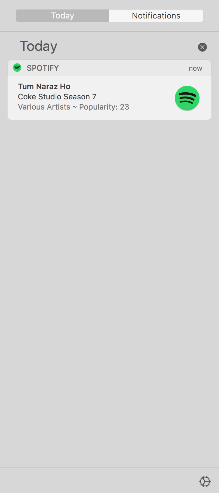

# Spot-Notify 

Notifications and more for Spotify App on Mac OS.

- This project provides a script that shows desktop notifications on _Mac OS_ that will contain name, artist, album, and other details of the song when the user starts playing or changes a song when using the Spotify Application.

- Users can select to Skip the song by clicking the Skip button in the notification.

- Clicking on the notification opens the Spotify Application.

- The project also aims to provide various shortcuts for Spotify to help users use various functionalities of the Spotify App without having to change their window while working. 

### Screenshots:
-------------------

#### Notification Example 1:

#### Notification Example 2: (On Hover)

#### Notification Example 3: (Notification Center)

### Ongoing work: 
	- Adding support for album artworks.
	- Making installation simpler.
	- Shortcuts for skip, forward, shuffle and repeat
	- Add to Spotify Library option

### Possible Future Work:
	- Convert the script to a Desktop App.

### Licenses:

- The code is licensed under the MIT license.

- The image _play-music-icon.png_ is licensed to Spotify AB Inc.

- The image _play-music-icon.png_ is created by Shirley Hernández Ticona from Noun Project and is under Creative Commons License.
