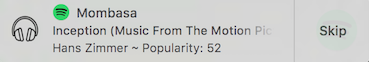
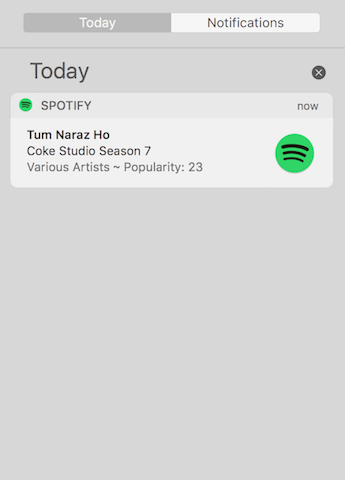

# Spot-Notify 

Notifications and more for Spotify App on Mac OS.

- This project provides a script that shows desktop notifications on _Mac OS_ that will contain name, artist, album, and other details of the song when the user starts playing or changes a song when using the Spotify Application.

- The notifications also display a **Popularity Score** for the song (on a scale of 100) that is currently being played, that indicates the popularity of the song on Spotify.

- Users can select to Skip the song by clicking the Skip button in the notification.

- Clicking on the notification opens the Spotify Application.

- The project also aims to provide various shortcuts for Spotify to help users use various functionalities of the Spotify App without having to change their window while working. 


### Requirements:
- macOS: >= 10.8

### Installation and Usage:
1. Clone the repository (https://github.com/pm2877/Spot-Notify.git) or download the zip file and unzip the contents.
2. Install Node if you don't already have it installed. The best way to do this is using homebrew:

	```brew install node```

3. Go to the directory where the directory Spot-Notify resides:

	```cd path/to/the/repository```

4. Install dependencies using the following command:

	```
	cd Spot-Notify
	npm install
	cd ..
	```

5. Run the script by typing the following in the terminal:

	```
	node Spot-Notify &
	```

6. The script will run in the background. When you play or change songs using Spotify, it will display notifications.
7. To quit, kill the process.

### Screenshots:
-------------------

- Notification Example 1:


- Notification Example 2: (On Hover)


- Notification Example 3: (Notification Center)


- Notification Example 4: (Lock Screen)


### Ongoing work: 
	- Adding support for album artworks.
	- Making installation simpler.
	- Shortcuts for skip, forward, shuffle and repeat
	- Add to Spotify Library option

### Possible Future Work:
	- Convert the script to a Desktop App.


### Dependencies:
- [node-notifier](https://github.com/mikaelbr/node-notifier)
- [spotify-node-applescript](https://github.com/andrehaveman/spotify-node-applescript)


### Licenses:

- All code is licensed under the [MIT](License.md) license.

- The image _play-music-icon.png_ is licensed to Spotify AB Inc.

- The image _play-music-icon.png_ is created by Shirley Hernández Ticona from Noun Project and is under Creative Commons License.
